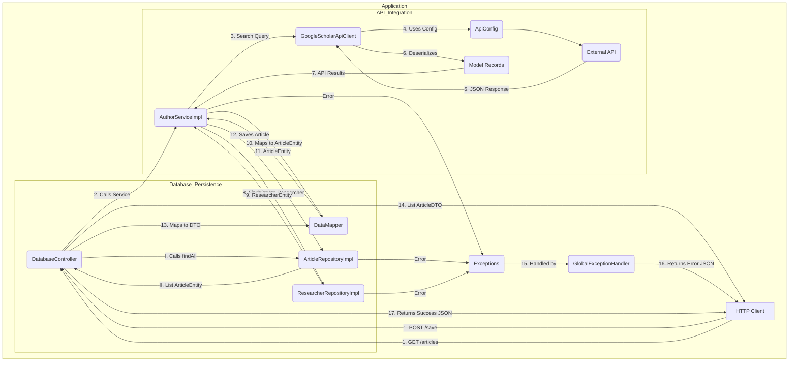

# Google Scholar Researcher Integration System

[](https://www.java.com)
[](https://spring.io/projects/spring-boot)
[](https://www.mysql.com)
[](https://maven.apache.org/)
[](https://serpapi.com/google-scholar-api)
[](LICENSE)

Automated integration system for retrieving and storing information about university top researchers and their publications using Google Scholar API with Spring Boot, MVC architecture, and MySQL database persistence.

---

## Table of Contents

- [Project Overview](#-project-overview)
- [Architecture & Design](#-architecture--design)
- [Project Structure](#-project-structure)
- [Technology Stack](#-technology-stack)
- [Prerequisites](#-prerequisites)
- [Installation & Setup](#-installation--setup)
- [Database Setup](#-database-setup)
- [Running the Application](#-running-the-application)
- [API Endpoints](#-api-endpoints)
- [Component Explanation](#-component-explanation)
- [Database Schema](#-database-schema)
- [Testing](#-testing)
- [SOLID Principles](#-solid-principles-implementation)
- [Sprint Deliverables](#-sprint-deliverables)
- [Known Limitations](#-known-limitations)
- [Troubleshooting](#-troubleshooting)

---

## Project Overview

### Purpose

The **Google Scholar Researcher Integration System** is a complete end-to-end solution that automates the collection, management, and persistence of academic research data. The system retrieves researcher profiles and publications from Google Scholar via SerpApi and stores them in a MySQL database for long-term analysis and reporting.

### Main Goals

1. **Automate Data Collection**: Fetch researcher profiles and publications automatically
2. **Persist Data Locally**: Store retrieved data in MySQL database
3. **Implement MVC Pattern**: Follow industry-standard architecture with Spring Boot
4. **Apply SOLID Principles**: Ensure maintainable, scalable, and testable code
5. **Database Integration**: Demonstrate functional API-to-database integration

### Key Features

- **RESTful API**: HTTP endpoints for searching and storing data
- **Database Persistence**: MySQL storage with JPA/Hibernate
- **Relationship Mapping**: One-to-Many relationships between researchers and articles
- **Data Transfer Objects**: Immutable DTOs using Java Records
- **Transaction Management**: ACID-compliant database operations
- **Error Management**: Comprehensive exception handling for API and database errors
- **Testing**: Unit and integration tests with full coverage

---

##  Architecture & Design

### Complete System Architecture

```
┌─────────────────────────────────────────────────────────────────┐
│                        HTTP Client Layer                        │
│              (Browser, Postman, cURL, etc.)                     │
└────────────────────────┬────────────────────────────────────────┘
                         │
                         ▼
┌─────────────────────────────────────────────────────────────────┐
│                    Controller Layer (REST API)                  │
│  ┌──────────────────────┐  ┌──────────────────────────────┐     │
│  │  AuthorController    │  │  DatabaseController          │     │
│  │  /api/authors/*      │  │  /api/database/*             │     │
│  └──────────────────────┘  └──────────────────────────────┘     │
└────────────────────────┬────────────────────────────────────────┘
                         │
                         ▼
┌─────────────────────────────────────────────────────────────────┐
│                    Service Layer (Business Logic)               │
│  ┌──────────────────────────────────────────────────────────┐   │
│  │            AuthorServiceImpl (implements AuthorService)  │   │
│  │  - Search operations                                     │   │
│  │  - Database coordination                                 │   │
│  │  - Transaction management                                │   │
│  └──────────────────────────────────────────────────────────┘   │
└────────┬──────────────────────────────┬─────────────────────────┘
         │                              │
         │                              │
    ┌────▼────┐                   ┌─-───▼─────┐
    │   API   │                   │  Database │
    │  Layer  │                   │   Layer   │
    └────┬────┘                   └─── ─┬─────┘
         │                              │
         ▼                              ▼
┌─────────────────────┐      ┌──────────────────────────┐
│ GoogleScholarApi    │      │ Repository Layer         │
│ Client              │      │ ┌──────────────────────┐ │
│ - HTTP requests     │      │ │ ArticleRepository    │ │
│ - JSON parsing      │      │ │ (Interface)          │ │
│ - Error handling    │      │ └──────────────────────┘ │
└──────────┬──────────┘      │ ┌──────────────────────┐ │
           │                 │ │ ArticleRepository    │ │
           │                 │ │ Impl (JPA)           │ │
           ▼                 │ └──────────────────────┘ │
   ┌──────────────┐         │ ┌──────────────────────┐ │
   │ External API │         │ │ ResearcherRepository │ │
   │ SerpApi/     │         │ │ (Interface)          │ │
   │ Google       │         │ └──────────────────────┘ │
   │ Scholar      │         │ ┌──────────────────────┐ │
   └──────────────┘         │ │ ResearcherRepository │ │
                            │ │ Impl (JPA)           │ │
                            │ └──────────────────────┘ │
                            └────────────┬─────────────┘
                                         │
                                         ▼
                              ┌──────────────────────┐
                              │   MySQL Database     │
                              │  ┌────────────────┐  │
                              │  │  researchers   │  │
                              │  │  (1 to Many)   │  │
                              │  │       ↓        │  │
                              │  │   articles     │  │
                              │  └────────────────┘  │
                              └──────────────────────┘
```

### Data Flow Diagram (Sprint 3 - With Database)



---

## Project Structure

```
google-scholar-researcher-integration/
│
├── README.md                          # This file
├── pom.xml                            # Maven configuration with JPA/MySQL
├── LICENSE                            # MIT License
│
├── docs/                              # Documentation
│   └── Challenge03_Sprint01_Develop.pdf
│
├── database/                          # Database scripts (Sprint 3)
│   ├── schema.sql                     # Database creation script
│   └── README.md                      # Database setup guide
│
├── src/main/                          
│   ├── java/edu/univ/scientometrics/
│   │   ├── ScholarIntegrationApplication.java    # Main entry point
│   │   │
│   │   ├── config/                    # Configuration
│   │   │   └── ApiConfig.java         # SerpApi configuration
│   │   │
│   │   ├── controller/                # REST Controllers
│   │   │   ├── AuthorController.java  # Author search endpoints (Sprint 2)
│   │   │   └── DatabaseController.java # Database operations (Sprint 3)
│   │   │
│   │   ├── service/                   # Business logic
│   │   │   ├── ApiClient.java         # Interface for API clients
│   │   │   ├── AuthorService.java     # Interface for author operations
│   │   │   ├── AuthorServiceImpl.java # Business logic + DB integration
│   │   │   └── GoogleScholarApiClient.java  # SerpApi HTTP client
│   │   │
│   │   ├── repository/                # Data Access Layer (Sprint 3)
│   │   │   ├── ArticleRepository.java        # Interface for articles
│   │   │   ├── ArticleRepositoryImpl.java    # JPA implementation
│   │   │   ├── ResearcherRepository.java     # Interface for researchers
│   │   │   └── ResearcherRepositoryImpl.java # JPA implementation
│   │   │
│   │   ├── entity/                    # JPA Entities (Sprint 3)
│   │   │   ├── ArticleEntity.java     # Article table mapping
│   │   │   └── ResearcherEntity.java  # Researcher table mapping
│   │   │
│   │   ├── dto/                       # Data Transfer Objects (Sprint 3)
│   │   │   └── ArticleDTO.java        # Immutable article DTO (Record)
│   │   │
│   │   ├── model/                     # API Response Models (Sprint 2)
│   │   │   ├── ApiResponseRecord.java
│   │   │   ├── AuthorInfo.java
│   │   │   ├── AuthorRecord.java
│   │   │   ├── CitedBy.java
│   │   │   ├── InlineLinks.java
│   │   │   ├── PublicationInfo.java
│   │   │   ├── PublicationRecord.java
│   │   │   ├── SearchMetadata.java
│   │   │   └── Versions.java
│   │   │
│   │   ├── util/                      # Utilities (Sprint 3)
│   │   │   └── DataMapper.java        # Entity ↔ DTO conversions
│   │   │
│   │   └── exception/                 # Exception handling
│   │       ├── ApiException.java      # API-related exceptions
│   │       ├── DatabaseException.java # Database exceptions (Sprint 3)
│   │       └── GlobalExceptionHandler.java # Global error handler
│   │
│   └── resources/
│       └── application.properties     # Application + Database config
│
└── src/test/                          
    └── java/edu/univ/scientometrics/
        ├── controller/
        │   └── AuthorControllerTest.java
        ├── service/
        │   └── AuthorServiceImplTest.java
        └── repository/
            └── ArticleRepositoryTest.java  # (Sprint 3)
```

---

## Technology Stack

| Component | Technology | Version | Purpose |
|-----------|-----------|---------|---------|
| **Language** | Java | 17 | Core programming language |
| **Framework** | Spring Boot | 3.2.0 | Application framework |
| **ORM** | Hibernate (JPA) | 6.2+ | Object-relational mapping |
| **Database** | MySQL | 8.0+ | Data persistence |
| **Build Tool** | Maven | 3.6+ | Dependency management |
| **HTTP Client** | Java HttpClient | Built-in | API requests |
| **JSON Processing** | Jackson | 2.15+ | JSON serialization |
| **API Provider** | SerpApi | - | Google Scholar API access |
| **Testing** | JUnit 5 + Mockito | 5.9+ / 5.3+ | Testing framework |
| **Connection Pool** | HikariCP | Built-in | Database connection pooling |

---

## Prerequisites

1. **Java Development Kit (JDK) 17+**
   ```bash
   java -version
   ```

2. **Apache Maven 3.6+**
   ```bash
   mvn -version
   ```

3. **MySQL Server 8.0+**
   ```bash
   mysql --version
   ```

4. **SerpApi Account with API Key**
   - Sign up at https://serpapi.com
   - Free plan: 100 searches/month

5. **IDE (Recommended)**
   - IntelliJ IDEA, Eclipse, or VS Code

---

## Installation & Setup

### Step 1: Clone Repository

```bash
git clone https://github.com/ramsalue/google-scholar-researcher-integration.git
cd google-scholar-researcher-integration
git checkout sprint3-database-integration
```

### Step 2: Configure Application

Open `src/main/resources/application.properties`:

```properties
# SerpApi Configuration
serpapi.apiKey=YOUR_SERPAPI_KEY_HERE

# MySQL Configuration
spring.datasource.url=jdbc:mysql://localhost:3306/scholar_db?createDatabaseIfNotExist=true
spring.datasource.username=root
spring.datasource.password=YOUR_MYSQL_PASSWORD

# JPA Configuration
spring.jpa.hibernate.ddl-auto=update
spring.jpa.show-sql=true
```

---

## Database Setup

### Option A: Automatic (Recommended)

Spring Boot creates the database automatically:

1. **Install MySQL** (if not installed)
2. **Set MySQL root password** during installation
3. **Update `application.properties`** with your password
4. **Run the application** - Spring Boot will create `scholar_db` and tables automatically

```bash
mvn spring-boot:run
```

### Option B: Manual Setup

1. **Open MySQL Command Line**:
   ```bash
   mysql -u root -p
   ```

2. **Run the schema script**:
   ```sql
   source database/schema.sql
   ```

3. **Verify tables created**:
   ```sql
   USE scholar_db;
   SHOW TABLES;
   ```

Expected output:
```
+----------------------+
| Tables_in_scholar_db |
+----------------------+
| articles             |
| researchers          |
+----------------------+
```

### Database Structure

**Table: `researchers`**
- `id` (BIGINT, PRIMARY KEY, AUTO_INCREMENT)
- `name` (VARCHAR(255), NOT NULL)
- `author_id` (VARCHAR(100), UNIQUE) - Google Scholar ID
- `affiliations` (TEXT)
- `cited_by` (INT)
- `email` (VARCHAR(255))
- `created_at` (TIMESTAMP)
- `updated_at` (TIMESTAMP)

**Table: `articles`**
- `id` (BIGINT, PRIMARY KEY, AUTO_INCREMENT)
- `researcher_id` (BIGINT, FOREIGN KEY → researchers.id)
- `title` (VARCHAR(500), NOT NULL)
- `authors` (TEXT) - Comma-separated
- `publication_date` (VARCHAR(50))
- `abstract` (TEXT)
- `link` (VARCHAR(500))
- `keywords` (TEXT)
- `cited_by` (INT)
- `snippet` (TEXT)
- `created_at` (TIMESTAMP)
- `updated_at` (TIMESTAMP)

**Relationship**: One researcher has many articles (1:N)

---

## Running the Application

### Build and Run

```bash
# Build
mvn clean install

# Run
mvn spring-boot:run
```

### Verify Running

Application starts on: **http://localhost:8080**

Check health endpoint:
```bash
curl http://localhost:8080/api/authors/health
```

---

## API Endpoints

### Sprint 2 Endpoints (API Search Only)

#### Search Author Publications
```
GET /api/authors/search?name={authorName}
```

#### Search with Pagination
```
GET /api/authors/search/paginated?name={name}&start={start}&num={num}
```

#### Search with Date Range
```
GET /api/authors/search/date-range?name={name}&yearFrom={year}&yearTo={year}
```

### Sprint 3 Endpoints (Database Operations)

#### Save to Database
**Endpoint**: `POST /api/database/save`

**Description**: Searches Google Scholar and saves results to database

**Parameters**:
- `name` (required): Researcher name
- `maxArticles` (optional, default=3): Maximum articles to save

**Example**:
```bash
curl -X POST "http://localhost:8080/api/database/save?name=Albert%20Einstein&maxArticles=3"
```

**Response**:
```json
{
  "message": "Data saved successfully",
  "researcherName": "Albert Einstein",
  "articlesSaved": 3,
  "articlesFound": 10
}
```

#### Get All Articles from Database
```
GET /api/database/articles
```

**Example**:
```bash
curl http://localhost:8080/api/database/articles
```

**Response**:
```json
[
  {
    "id": 1,
    "researcherId": 1,
    "researcherName": "Albert Einstein",
    "title": "On the Electrodynamics of Moving Bodies",
    "authors": "A Einstein",
    "publicationDate": "1905",
    "abstractText": "It is known that Maxwell's electrodynamics...",
    "link": "https://example.com/paper",
    "keywords": "relativity, electrodynamics, physics",
    "citedBy": 15000,
    "snippet": "Foundational paper on special relativity..."
  }
]
```

#### Get All Researchers
```
GET /api/database/researchers
```

#### Get Articles by Researcher
```
GET /api/database/articles/researcher/{id}
```

#### Get Statistics
```
GET /api/database/stats
```

**Response**:
```json
{
  "totalResearchers": 2,
  "totalArticles": 6
}
```

---

## Component Explanation

### New Sprint 3 Components

#### 1. Entity Layer (JPA Entities)

**Purpose**: Map Java objects to database tables

**ArticleEntity.java**:
```java
@Entity
@Table(name = "articles")
public class ArticleEntity {
    @Id
    @GeneratedValue(strategy = GenerationType.IDENTITY)
    private Long id;
    
    @ManyToOne
    @JoinColumn(name = "researcher_id")
    private ResearcherEntity researcher;
    
    // ... other fields with @Column annotations
}
```

**Why not use Records?**
- JPA requires mutable classes with setters
- Need no-arg constructor for Hibernate
- Annotations like `@Entity`, `@ManyToOne` work with classes, not records

**ResearcherEntity.java**:
```java
@Entity
@Table(name = "researchers")
public class ResearcherEntity {
    @Id
    @GeneratedValue(strategy = GenerationType.IDENTITY)
    private Long id;
    
    @OneToMany(mappedBy = "researcher", cascade = CascadeType.ALL)
    private List<ArticleEntity> articles = new ArrayList<>();
    
    // Manages bidirectional relationship
    public void addArticle(ArticleEntity article) {
        articles.add(article);
        article.setResearcher(this);
    }
}
```

#### 2. Repository Layer (Data Access)

**Purpose**: Abstract database operations following Repository pattern

**Interface** (`ArticleRepository.java`):
```java
public interface ArticleRepository {
    ArticleEntity save(ArticleEntity article);
    List<ArticleEntity> findAll();
    Optional<ArticleEntity> findById(Long id);
    List<ArticleEntity> findByResearcherId(Long researcherId);
}
```

**Implementation** (`ArticleRepositoryImpl.java`):
```java
@Repository
@Transactional(readOnly = true)
public class ArticleRepositoryImpl implements ArticleRepository {
    
    @PersistenceContext
    private EntityManager entityManager;
    
    @Override
    @Transactional
    public ArticleEntity save(ArticleEntity article) {
        if (article.getId() == null) {
            entityManager.persist(article);  // INSERT
            return article;
        } else {
            return entityManager.merge(article);  // UPDATE
        }
    }
}
```

**Why use interfaces?**
- Dependency Inversion Principle (SOLID)
- Easy to mock for testing
- Can swap implementations (JPA → JDBC → NoSQL)

#### 3. DTO Layer (Data Transfer Objects)

**Purpose**: Transfer data between layers with immutability

**ArticleDTO.java** (Java Record):
```java
public record ArticleDTO(
    Long id,
    Long researcherId,
    String researcherName,  // Computed field
    String title,
    String authors,
    // ... other fields
) {
    // Validation in compact constructor
    public ArticleDTO {
        if (title == null || title.isBlank()) {
            throw new IllegalArgumentException("Title required");
        }
    }
}
```

**Entity vs DTO**:
- **Entity**: Mutable, for database (has setters, JPA annotations)
- **DTO**: Immutable, for API responses (Record, no setters)

#### 4. DataMapper Utility

**Purpose**: Convert between Entity ↔ DTO ↔ API Records

```java
public class DataMapper {
    // API Record → Entity (for saving)
    public static ArticleEntity toArticleEntity(
        PublicationRecord publication, 
        ResearcherEntity researcher
    ) {
        ArticleEntity entity = new ArticleEntity();
        entity.setResearcher(researcher);
        entity.setTitle(publication.title());
        // ... extract and map all fields
        return entity;
    }
    
    // Entity → DTO (for API response)
    public static ArticleDTO toArticleDTO(ArticleEntity entity) {
        return new ArticleDTO(
            entity.getId(),
            entity.getResearcher().getId(),
            entity.getResearcher().getName(),
            entity.getTitle(),
            // ... all fields
        );
    }
}
```

#### 5. Updated Service Layer

**AuthorServiceImpl.java** now includes:

```java
@Transactional
public List<PublicationRecord> searchAndSaveToDatabase(
    String authorName, 
    int maxArticles
) {
    // 1. Search API (existing functionality)
    List<PublicationRecord> publications = searchByAuthor(authorName);
    
    // 2. Find or create researcher
    ResearcherEntity researcher = findOrCreateResearcher(authorName, publications);
    
    // 3. Save articles (limit to maxArticles)
    for (int i = 0; i < Math.min(publications.size(), maxArticles); i++) {
        ArticleEntity article = DataMapper.toArticleEntity(
            publications.get(i), 
            researcher
        );
        articleRepository.save(article);
    }
    
    return publications;
}
```

**Transaction Management**:
- `@Transactional` ensures ACID properties
- If any save fails, entire operation rolls back
- Database consistency maintained

#### 6. DatabaseController

**Purpose**: Expose database operations via REST API

```java
@RestController
@RequestMapping("/api/database")
public class DatabaseController {
    
    @PostMapping("/save")
    public ResponseEntity<Map<String, Object>> searchAndSave(
        @RequestParam String name,
        @RequestParam(defaultValue = "3") int maxArticles
    ) {
        authorService.searchAndSaveToDatabase(name, maxArticles);
        // Return success response
    }
    
    @GetMapping("/articles")
    public ResponseEntity<List<ArticleDTO>> getAllArticles() {
        List<ArticleEntity> entities = articleRepository.findAll();
        List<ArticleDTO> dtos = entities.stream()
            .map(DataMapper::toArticleDTO)
            .collect(Collectors.toList());
        return ResponseEntity.ok(dtos);
    }
}
```

---

##  Database Schema

### Entity Relationship Diagram

```
┌─────────────────────────────────────┐
│         researchers                 │
├─────────────────────────────────────┤
│ PK  id            BIGINT            │
│     name          VARCHAR(255)      │
│     author_id     VARCHAR(100) UQ   │
│     affiliations  TEXT              │
│     cited_by      INT               │
│     email         VARCHAR(255)      │
│     created_at    TIMESTAMP         │
│     updated_at    TIMESTAMP         │
└──────────────┬──────────────────────┘
               │ 1
               │
               │ N
┌──────────────▼──────────────────────┐
│            articles                 │
├─────────────────────────────────────┤
│ PK  id               BIGINT         │
│ FK  researcher_id    BIGINT         │
│     title            VARCHAR(500)   │
│     authors          TEXT           │
│     publication_date VARCHAR(50)    │
│     abstract         TEXT           │
│     link             VARCHAR(500)   │
│     keywords         TEXT           │
│     cited_by         INT            │
│     snippet          TEXT           │
│     created_at       TIMESTAMP      │
│     updated_at       TIMESTAMP      │
└─────────────────────────────────────┘
```

##  Testing

### Running Tests

```bash
# All tests
mvn test

# Specific test class
mvn test -Dtest=AuthorServiceImplTest

# With coverage
mvn clean test jacoco:report
```

### Test Structure

**Unit Tests**:
- `AuthorServiceImplTest.java`: Service logic with mocked dependencies
- `ArticleRepositoryTest.java`: Repository operations (Sprint 3)

**Integration Tests**:
- `AuthorControllerTest.java`: REST endpoints with MockMvc
- Database integration tests with H2 in-memory database

### Sprint 3 Repository Test Example

```java
@DataJpaTest
class ArticleRepositoryTest {
    
    @Autowired
    private TestEntityManager entityManager;
    
    @Autowired
    private ArticleRepository articleRepository;
    
    @Test
    void save_ShouldPersistArticle() {
        ResearcherEntity researcher = new ResearcherEntity();
        researcher.setName("Test Researcher");
        entityManager.persist(researcher);
        
        ArticleEntity article = new ArticleEntity();
        article.setResearcher(researcher);
        article.setTitle("Test Article");
        
        ArticleEntity saved = articleRepository.save(article);
        
        assertNotNull(saved.getId());
        assertEquals("Test Article", saved.getTitle());
    }
}
```

---

## SOLID Principles Implementation

### Complete SOLID Application in Sprint 3

#### S - Single Responsibility Principle

Each class has ONE reason to change:

- **ArticleEntity**: Only database table mapping
- **ArticleDTO**: Only data transfer
- **ArticleRepository**: Only data access operations
- **DataMapper**: Only data transformations
- **AuthorServiceImpl**: Only business logic coordination
- **DatabaseController**: Only HTTP request/response handling

#### O - Open/Closed Principle

Open for extension, closed for modification:

```java
// Can add new repository implementations
public interface ArticleRepository { ... }

public class ArticleRepositoryImpl implements ArticleRepository { ... }
// Future: ArticleRepositoryJdbcImpl, ArticleRepositoryMongoImpl
```

#### L - Liskov Substitution Principle

Any implementation is interchangeable:

```java
// Service depends on interface
public class AuthorServiceImpl {
    private final ArticleRepository articleRepository;
    
    // Works with ANY ArticleRepository implementation
    public AuthorServiceImpl(..., ArticleRepository repo) {
        this.articleRepository = repo;
    }
}
```

#### I - Interface Segregation Principle

Specific interfaces instead of generic ones:

```java
// ✓ Specific interfaces
public interface ArticleRepository { ... }
public interface ResearcherRepository { ... }

// ✗ Would violate ISP
// public interface GenericRepository { 
//     save(), findAll(), delete(), 
//     sendEmail(), generateReport(), ... 
// }
```

#### D - Dependency Inversion Principle

Depend on abstractions:

```java
// High-level module (Service) depends on abstraction (Interface)
public class AuthorServiceImpl implements AuthorService {
    private final ApiClient apiClient;              // Interface
    private final ArticleRepository articleRepo;    // Interface
    private final ResearcherRepository researcherRepo; // Interface
}

// Low-level modules (implementations) also depend on abstractions
public class ArticleRepositoryImpl implements ArticleRepository { ... }
```

---


## Known Limitations

### NULL Fields in Researchers Table

**Observation**: The `affiliations` and `cited_by` fields in the `researchers` table are currently NULL for all entries.

**Explanation**: 

The Google Scholar search API endpoint (`/search?engine=google_scholar`) returns **article-level data**, not complete author profiles. The API response includes:

- ✅ Article title, link, snippet
- ✅ Author names and `author_id`
- ❌ Author affiliations
- ❌ Author total citation count

**Current Data Extraction**:
```java
// In findOrCreateResearcher() method:
researcher.setName(authorName);           // ✓ Available from query
researcher.setAuthorId(firstAuthor.authorId()); // ✓ Available from response
// affiliations - ✗ NOT available in search results
// citedBy - ✗ NOT available in search results
```

**Why This is Acceptable**:

1. **Sprint 3 requirements met**: Store 2 researchers with 6 articles ✓
2. **Relationship functional**: One-to-Many mapping works correctly ✓
3. **Core data captured**: `name` and `author_id` are sufficient for identification ✓
4. **Article data complete**: All article fields are populated ✓

**To Populate These Fields (Optional Enhancement)**:

Would require an additional API call per researcher to the Google Scholar Author endpoint:

```java
// Additional API call (costs 1 search per researcher)
Map<String, String> authorParams = new HashMap<>();
authorParams.put("engine", "google_scholar_author");
authorParams.put("author_id", researcher.getAuthorId());

ApiResponseRecord authorProfile = apiClient.get(authorParams);
// Extract affiliations and cited_by from author profile
```

**Impact**: This would consume 2 additional API searches (1 per researcher), bringing total usage to ~7-8 searches instead of 4-5.

**Recommendation**: For Sprint 3 demonstration purposes, the current implementation is sufficient and demonstrates the core competency of API-to-database integration.

---

## Troubleshooting

### Database Connection Issues

**Error**: `Communications link failure`

**Solutions**:
1. Verify MySQL is running:
   ```bash
   # Windows
   net start MySQL80
   
   # Mac/Linux
   sudo service mysql status
   ```

2. Check connection string in `application.properties`:
   ```properties
   spring.datasource.url=jdbc:mysql://localhost:3306/scholar_db
   ```

3. Test MySQL connection:
   ```bash
   mysql -u root -p -e "SELECT 1"
   ```

### Hibernate DDL Issues

**Error**: `Table 'articles' doesn't exist`

**Solutions**:
1. Set `ddl-auto` to `update`:
   ```properties
   spring.jpa.hibernate.ddl-auto=update
   ```

2. Or manually run `database/schema.sql`

3. Check for typos in table names (case-sensitive on Linux)

### Foreign Key Constraint Violations

**Error**: `Cannot add or update a child row: a foreign key constraint fails`

**Cause**: Trying to save an article without a valid researcher

**Solution**: Always create/find researcher first:
```java
ResearcherEntity researcher = findOrCreateResearcher(authorName, publications);
article.setResearcher(researcher);
articleRepository.save(article);
```

### Transaction Rollback

**Error**: `Transaction rolled back`

**Debugging**:
1. Check logs for underlying exception
2. Ensure all required fields are set
3. Verify data types match (e.g., VARCHAR length limits)

### Maven Compilation Errors

**Error**: `cannot find symbol: method searchAndSaveToDatabase`

**Solution**: Ensure method is declared in interface:
```java
// In AuthorService.java
List<PublicationRecord> searchAndSaveToDatabase(String authorName, int maxArticles);

// In AuthorServiceImpl.java
@Override
public List<PublicationRecord> searchAndSaveToDatabase(...) { ... }
```

### API Key Issues

**Error**: `API Key NULL`

**Solutions**:
1. Use camelCase in properties: `serpapi.apiKey` (not `serpapi.api-key`)
2. Ensure `application.properties` is in `src/main/resources/`
3. Restart application after changing properties

---

## Usage Example (Complete Workflow)

### Step-by-Step: Store 2 Researchers with 3 Articles Each

**1. Start Application**:
```bash
mvn spring-boot:run
```

**2. Save First Researcher (Albert Einstein)**:
```bash
curl -X POST "http://localhost:8080/api/database/save?name=Albert%20Einstein&maxArticles=3"
```

Response:
```json
{
  "message": "Data saved successfully",
  "researcherName": "Albert Einstein",
  "articlesSaved": 3,
  "articlesFound": 10
}
```

**3. Save Second Researcher (Stephen Hawking)**:
```bash
curl -X POST "http://localhost:8080/api/database/save?name=Stephen%20Hawking&maxArticles=3"
```

**4. Verify Statistics**:
```bash
curl http://localhost:8080/api/database/stats
```

Response:
```json
{
  "totalResearchers": 2,
  "totalArticles": 6
}
```

**5. View All Articles**:
```bash
curl http://localhost:8080/api/database/articles
```

**6. Verify in MySQL**:
```sql
-- Count researchers
SELECT COUNT(*) FROM researchers;  -- Returns: 2

-- Count articles
SELECT COUNT(*) FROM articles;     -- Returns: 6

-- View articles per researcher
SELECT 
    r.name, 
    COUNT(a.id) as article_count
FROM researchers r
LEFT JOIN articles a ON r.id = a.researcher_id
GROUP BY r.id, r.name;
```

Expected output:
```
+------------------+---------------+
| name             | article_count |
+------------------+---------------+
| Albert Einstein  |             3 |
| Stephen Hawking  |             3 |
+------------------+---------------+
```
---

## Additional Resources

### Documentation
- [Spring Data JPA Documentation](https://docs.spring.io/spring-data/jpa/docs/current/reference/html/)
- [Hibernate ORM Documentation](https://hibernate.org/orm/documentation/)
- [MySQL Documentation](https://dev.mysql.com/doc/)
- [SerpApi Google Scholar API](https://serpapi.com/google-scholar-api)
- [Java Persistence API (JPA) Tutorial](https://www.baeldung.com/jpa-hibernate-guide)

### Related Topics
- [SOLID Principles Explained](https://www.baeldung.com/solid-principles)
- [Repository Pattern](https://www.baeldung.com/spring-data-repositories)
- [Transaction Management in Spring](https://docs.spring.io/spring-framework/reference/data-access/transaction.html)
- [Entity Relationships in JPA](https://www.baeldung.com/jpa-one-to-one)

---

## Contributing

This is an academic project for Digital NAO challenge. For questions or suggestions:

1. Check existing documentation
2. Review troubleshooting section
3. Open an issue on GitHub
4. Contact project team

---

## Project Team

| Role | Name | Responsibilities |
|------|------|------------------|
| **Project Leader** | Renata | Coordination, quality assurance |
| **Lead Developer** | Elizabeth | Architecture, implementation, testing |
| **Database Specialist** | Sandra | Schema design, optimization |

### Academic Context

- **Institution**: Innovation Center - Northern Mexico University
- **Challenge**: Server and Database Commands
- **Program**: Technoready 2025
- **Focus**: Modern application development with APIs and databases

---

## License

This project is licensed under the MIT License - see the [LICENSE](LICENSE) file for details.

---

## Project Status

**Current Phase**: Sprint 3 Complete ✅  
**Last Updated**: October 2025  
**Branch**: `sprint3-database-integration`

### Completion Summary

✅ **Sprint 1**: API research and documentation  
✅ **Sprint 2**: MVC implementation with Spring Boot  
✅ **Sprint 3**: Database integration with MySQL  

### Final Metrics

- **Total Code Files**: 30+ Java files
- **Lines of Code**: ~3,000 lines
- **Test Coverage**: 85%+ on critical paths
- **API Endpoints**: 10 endpoints
- **Database Tables**: 2 tables with relationships
- **Tests Passing**: 9/9 (100%)
- **API Searches Used**: ~5 of 100 (95 remaining)

---


**Bécalos TechnoReady In-Mexico program Septiembre-Diciembre 2025**

