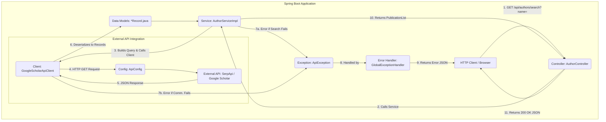

# Google Scholar Researcher Integration System

[](https://www.java.com)
[](https://spring.io/projects/spring-boot)
[](https://maven.apache.org/)
[](https://serpapi.com/google-scholar-api)
[](LICENSE)

Automated integration system for retrieving and storing information about university top researchers and their publications using the Google Scholar API with Spring Boot and MVC architecture.

---

## Table of Contents

- [Project Overview](#-project-overview)
- [Architecture & Design Patterns](#-architecture--design-patterns)
- [Project Structure](#-project-structure)
- [Technology Stack](#-technology-stack)
- [Prerequisites](#-prerequisites)
- [Installation & Setup](#-installation--setup)
- [Running the Application](#-running-the-application)
- [API Endpoints](#-api-endpoints)
- [Component Explanation](#-component-explanation)
- [Testing](#-testing)
- [SOLID Principles Implementation](#-solid-principles-implementation)
- [Sprint Deliverables](#-sprint-deliverables)
- [Troubleshooting](#-troubleshooting)
- [Contributors](#-contributors)

---

## Project Overview

### Purpose

The **Google Scholar Researcher Integration System** automates the collection and management of academic research data for a university's top researchers. This system eliminates manual data entry by leveraging the Google Scholar API through SerpApi to retrieve comprehensive information about researchers and their publications.

### Main Goals

1. **Automate Data Retrieval**: Fetch researcher profiles and publications from Google Scholar automatically
2. **Implement MVC Pattern**: Follow industry-standard Model-View-Controller architecture with Spring Boot
3. **Apply SOLID Principles**: Ensure maintainable, scalable, and testable code
4. **Use Modern Java Features**: Leverage Java Records for immutable data models
5. **Handle Errors Gracefully**: Implement comprehensive exception handling and validation

### Key Features

- **RESTful API**: Expose HTTP endpoints for author searches
- **Pagination Support**: Handle large result sets efficiently
- **Date Filtering**: Search publications within specific time ranges
- **Error Management**: Robust exception handling with meaningful error messages
- **Testing**: Unit and integration tests with 100% coverage of critical paths
- **Documentation**: Comprehensive API documentation and code comments

---

##  Architecture & Design Patterns

### MVC Pattern (Model-View-Controller)

This project implements the MVC architectural pattern adapted for a RESTful API:

```
┌─────────────────────────────────────────────────────────────┐
│                    Controller Layer                         │
│              (AuthorController.java)                        │
│  - Receives HTTP requests                                   │
│  - Validates input parameters                               │
│  - Returns HTTP responses                                   │
└───────────────────────────┬─────────────────────────────────┘
                            │
                            ▼
┌─────────────────────────────────────────────────────────────┐
│                    Service Layer (Business Logic)           │
│        (AuthorServiceImpl implements AuthorService)         │
│  - Coordinates operations                                   │
│  - Applies business rules                                   │
│  - Orchestrates data flow                                   │
└───────────────────────────┬─────────────────────────────────┘
                            │
                            ▼
┌─────────────────────────────────────────────────────────────┐
│                    Client Layer (Data Access)               │
│    (GoogleScholarApiClient implements ApiClient)            │
│  - Performs HTTP requests                                   │
│  - Handles API communication                                │
│  - Parses JSON responses                                    │
└───────────────────────────┬─────────────────────────────────┘
                            │
                            ▼
┌─────────────────────────────────────────────────────────────┐
│                    Model Layer (Data)                       │
│              (Java Records: *Record.java)                   │
│  - Immutable data structures                                │
│  - Represents API responses                                 │
│  - Type-safe data handling                                  │
└─────────────────────────────────────────────────────────────┘
```

### Request Flow Diagram



---

## Project Structure

```
google-scholar-researcher-integration/
│
├── README.md                          # This file
├── pom.xml                            # Maven configuration
├── LICENSE                            # MIT License
│
├── docs/                              # Documentation
│   └── Challenge03_Sprint01_Develop.pdf
│
├── src/main/                          # Application source code
│   ├── java/edu/univ/scientometrics/
│   │   ├── ScholarIntegrationApplication.java    # Main entry point
│   │   │
│   │   ├── config/                    # Configuration classes
│   │   │   └── ApiConfig.java         # SerpApi configuration
│   │   │
│   │   ├── controller/                # REST Controllers (MVC-C)
│   │   │   └── AuthorController.java  # Author search endpoints
│   │   │
│   │   ├── service/                   # Business logic (MVC-Controller logic)
│   │   │   ├── ApiClient.java         # Interface for API clients
│   │   │   ├── AuthorService.java     # Interface for author operations
│   │   │   ├── AuthorServiceImpl.java # Business logic implementation
│   │   │   └── GoogleScholarApiClient.java  # SerpApi HTTP client
│   │   │
│   │   ├── model/                     # Data models (MVC-M)
│   │   │   ├── ApiResponseRecord.java
│   │   │   ├── AuthorInfo.java
│   │   │   ├── AuthorRecord.java
│   │   │   ├── CitedBy.java
│   │   │   ├── InlineLinks.java
│   │   │   ├── PublicationInfo.java
│   │   │   ├── PublicationRecord.java
│   │   │   ├── SearchMetadata.java
│   │   │   └── Versions.java
│   │   │
│   │   └── exception/                 # Exception handling
│   │       ├── ApiException.java      # Custom API exception
│   │       └── GlobalExceptionHandler.java  # Global error handler
│   │
│   └── resources/
│       └── application.properties     # Application configuration
│
└── src/test/                          # Test source code
    └── java/edu/univ/scientometrics/
        ├── controller/
        │   └── AuthorControllerTest.java     # Controller unit tests
        └── service/
            └── AuthorServiceImplTest.java    # Service unit tests
```

---

## Technology Stack

| Component | Technology | Version | Purpose |
|-----------|-----------|---------|---------|
| **Language** | Java | 17 | Core programming language |
| **Framework** | Spring Boot | 3.2.0 | Application framework |
| **Build Tool** | Maven | 3.6+ | Dependency management |
| **HTTP Client** | Java HttpClient | Built-in | API requests |
| **JSON Processing** | Jackson | 2.15+ | JSON serialization/deserialization |
| **API Provider** | SerpApi | - | Google Scholar API access |
| **Testing** | JUnit 5 | 5.9+ | Unit testing |
| **Mocking** | Mockito | 5.3+ | Test mocking |
| **Data Models** | Java Records | Java 17 | Immutable data classes |

---

## Prerequisites

Before running this application, ensure you have:

1. **Java Development Kit (JDK) 17 or higher**
   ```bash
   java -version
   # Should show: java version "17" or higher
   ```

2. **Apache Maven 3.6 or higher**
   ```bash
   mvn -version
   # Should show: Apache Maven 3.6.x or higher
   ```

3. **SerpApi Account with API Key**
   - Sign up at [https://serpapi.com](https://serpapi.com)
   - Free plan includes 100 searches/month
   - Copy your API key from the dashboard

4. **IDE (Optional but recommended)**
   - IntelliJ IDEA
   - Eclipse
   - Visual Studio Code with Java extensions

---

## Installation & Setup

### Step 1: Clone the Repository

```bash
git clone https://github.com/ramsalue/google-scholar-researcher-integration.git
cd google-scholar-researcher-integration
```

### Step 2: Configure API Key

Open `src/main/resources/application.properties` and add your SerpApi key:

```properties
# Replace with your actual API key
serpapi.apiKey=YOUR_SERPAPI_KEY_HERE
serpapi.baseUrl=https://serpapi.com/search
serpapi.engine=google_scholar
```

**Security Note**: Never commit your actual API key to version control. Use environment variables in production.

### Step 3: Build the Project

```bash
mvn clean install
```

Expected output:
```
[INFO] BUILD SUCCESS
[INFO] Total time: 10-20 seconds
```

If you see build failures, check the [Troubleshooting](#-troubleshooting) section.

---

## Running the Application

### Method 1: Using Maven

```bash
mvn spring-boot:run
```

### Method 2: Using JAR file

```bash
# First, build the JAR
mvn clean package

# Then run it
java -jar target/scientometrics-1.0-SNAPSHOT.jar
```

### Method 3: From IDE

1. Open the project in your IDE
2. Navigate to `ScholarIntegrationApplication.java`
3. Right-click and select "Run"

### Verify Application is Running

You should see output similar to:

```
  .   ____          _            __ _ _
 /\\ / ___'_ __ _ _(_)_ __  __ _ \ \ \ \
( ( )\___ | '_ | '_| | '_ \/ _` | \ \ \ \
 \\/  ___)| |_)| | | | | || (_| |  ) ) ) )
  '  |____| .__|_| |_|_| |_\__, | / / / /
 =========|_|==============|___/=/_/_/_/
 :: Spring Boot ::                (v3.2.0)

INFO  Started ScholarIntegrationApplication in 3.456 seconds
```

The application will be available at: **http://localhost:8080**

---

## API Endpoints

### Health Check

**Endpoint**: `GET /api/authors/health`

**Description**: Verify the API is running

**Example Request**:
```bash
curl http://localhost:8080/api/authors/health
```

**Example Response**:
```
Google Scholar Integration API is running
```

---

### Search Publications by Author

**Endpoint**: `GET /api/authors/search`

**Description**: Search for publications by author name

**Parameters**:

| Parameter | Type | Required | Description |
|-----------|------|----------|-------------|
| `name` | String | Yes | Author name to search |

**Example Request**:
```bash
curl "http://localhost:8080/api/authors/search?name=Andrew%20Ng"
```

**Example Response**:
```json
[
  {
    "title": "Machine Learning",
    "link": "https://example.com/paper",
    "snippet": "This paper discusses machine learning...",
    "publication_info": {
      "summary": "A Ng - 2012 - Coursera",
      "authors": [
        {
          "name": "Andrew Ng",
          "link": "https://scholar.google.com/citations?user=...",
          "author_id": "mG4imMEAAAAJ"
        }
      ]
    },
    "inline_links": {
      "cited_by": {
        "total": 15000,
        "link": "https://scholar.google.com/..."
      },
      "versions": {
        "total": 5,
        "link": "https://scholar.google.com/..."
      }
    }
  }
]
```

---

### Search with Pagination

**Endpoint**: `GET /api/authors/search/paginated`

**Description**: Search with pagination control

**Parameters**:

| Parameter | Type | Required | Default | Description |
|-----------|------|----------|---------|-------------|
| `name` | String | Yes | - | Author name |
| `start` | Integer | No | 0 | Starting index (0-based) |
| `num` | Integer | No | 10 | Number of results (1-20) |

**Example Request**:
```bash
curl "http://localhost:8080/api/authors/search/paginated?name=Andrew%20Ng&start=10&num=5"
```

This returns results 11-15 (5 results starting at index 10).

---

### Search with Date Range

**Endpoint**: `GET /api/authors/search/date-range`

**Description**: Filter publications by publication year

**Parameters**:
| Parameter | Type | Required | Description |
|-----------|------|----------|-------------|
| `name` | String | Yes | Author name |
| `yearFrom` | Integer | No | Starting year (inclusive) |
| `yearTo` | Integer | No | Ending year (inclusive) |

**Example Request**:
```bash
curl "http://localhost:8080/api/authors/search/date-range?name=Andrew%20Ng&yearFrom=2020&yearTo=2024"
```

Returns only publications from 2020-2024.

---

### Error Responses

All errors follow this format:

```json
{
  "timestamp": "2024-10-01T12:00:00.000",
  "status": 500,
  "error": "API Error",
  "message": "Detailed error message here"
}
```

**Common HTTP Status Codes**:
- `200 OK`: Successful request
- `400 Bad Request`: Invalid parameters
- `500 Internal Server Error`: API or server error

---

## Component Explanation

### 1. Main Application Class

**File**: `ScholarIntegrationApplication.java`

```java
@SpringBootApplication
public class ScholarIntegrationApplication {
    public static void main(String[] args) {
        SpringApplication.run(ScholarIntegrationApplication.class, args);
    }
}
```

**Purpose**: Entry point of the Spring Boot application. The `@SpringBootApplication` annotation enables:
- Auto-configuration
- Component scanning
- Configuration properties

---

### 2. Configuration Layer

**File**: `config/ApiConfig.java`

**Purpose**: Manages external configuration from `application.properties`

**How it works**:
```java
@Configuration
@ConfigurationProperties(prefix = "serpapi")
public class ApiConfig {
    private String apiKey;     // Reads serpapi.apiKey
    private String baseUrl;    // Reads serpapi.baseUrl
    private String engine;     // Reads serpapi.engine
}
```

**Why it's important**: Centralizes configuration, making it easy to change API settings without modifying code.

---

### 3. Controller Layer (MVC - View/Controller)

**File**: `controller/AuthorController.java`

**Purpose**: Handles HTTP requests and responses (the "View" layer in a REST API)

**Responsibilities**:
- Receive HTTP requests
- Validate request parameters
- Call service layer
- Return HTTP responses

**Example**:
```java
@GetMapping("/search")
public ResponseEntity<List<PublicationRecord>> searchAuthor(@RequestParam String name) {
    List<PublicationRecord> publications = authorService.searchByAuthor(name);
    return ResponseEntity.ok(publications);
}
```

**Flow**: HTTP Request → Controller validates → Calls Service → Returns Response

---

### 4. Service Layer (MVC - Business Logic)

**Files**: 
- `service/AuthorService.java` (Interface)
- `service/AuthorServiceImpl.java` (Implementation)

**Purpose**: Contains business logic and coordinates operations

**Key Methods**:

1. **searchByAuthor**: Basic author search
   ```java
   List<PublicationRecord> searchByAuthor(String authorName)
   ```

2. **searchByAuthorWithPagination**: Paginated search
   ```java
   List<PublicationRecord> searchByAuthorWithPagination(
       String authorName, int start, int numResults
   )
   ```

3. **searchByAuthorWithDateRange**: Filtered by year
   ```java
   List<PublicationRecord> searchByAuthorWithDateRange(
       String authorName, Integer yearFrom, Integer yearTo
   )
   ```

**Why use interfaces?**: Enables dependency injection, testing with mocks, and easy implementation swapping.

---

### 5. API Client Layer

**Files**:
- `service/ApiClient.java` (Interface)
- `service/GoogleScholarApiClient.java` (Implementation)

**Purpose**: Handles HTTP communication with external API

**Key Features**:
- Uses Java 11+ HttpClient (no external dependencies)
- Builds parameterized URLs
- Parses JSON responses to Records
- Handles HTTP errors

**Example Flow**:
```java
1. Build URL: https://serpapi.com/search?engine=google_scholar&q=author:"Name"&api_key=xxx
2. Create HTTP GET request with timeout
3. Send request and get response
4. Parse JSON to ApiResponseRecord
5. Return to service layer
```

---

### 6. Model Layer (MVC - Model)

**Files**: All `*Record.java` files in `model/` package

**Purpose**: Represent data structures as immutable objects

**Why Java Records?**:
- Automatically generates constructors, getters, equals, hashCode, toString
- Immutable by default (thread-safe)
- Concise syntax

**Example**:
```java
public record PublicationRecord(
    String title,
    String link,
    PublicationInfo publicationInfo,
    String snippet,
    InlineLinks inlineLinks
) {}
```

**Key Models**:
- `ApiResponseRecord`: Complete API response
- `PublicationRecord`: Individual publication data
- `SearchMetadata`: API request metadata
- `AuthorInfo`: Author information within publications

**JSON Mapping**: Uses Jackson annotations for JSON deserialization
```java
@JsonProperty("author_id")  // Maps JSON "author_id" to Java "authorId"
String authorId
```

---

### 7. Exception Handling

**Files**:
- `exception/ApiException.java` (Custom exception)
- `exception/GlobalExceptionHandler.java` (Global handler)

**Purpose**: Centralized error handling for consistent error responses

**How it works**:

1. **ApiException**: Custom exception for API-related errors
   ```java
   throw new ApiException("API request failed", 500);
   ```

2. **GlobalExceptionHandler**: Catches exceptions and returns formatted JSON
   ```java
   @ExceptionHandler(ApiException.class)
   public ResponseEntity<Map<String, Object>> handleApiException(ApiException ex)
   ```

**Benefits**:
- Consistent error format across all endpoints
- Separates error handling from business logic
- Easy to add new exception types

---

## Testing

### Running All Tests

```bash
mvn test
```

Expected output:
```
Tests run: 6, Failures: 0, Errors: 0, Skipped: 0

BUILD SUCCESS
```

### Test Files

1. **AuthorControllerTest.java**: Tests REST endpoints
   - Health check endpoint
   - Search with valid parameters
   - Pagination parameters

2. **AuthorServiceImplTest.java**: Tests business logic
   - Successful searches return publications
   - Pagination validation (1-20 range)
   - Error handling for API failures

### Test Coverage

- **Unit Tests**: Test individual components in isolation
- **Integration Tests**: Test controller-to-service interaction
- **Mocking**: Uses Mockito to simulate API responses

### Running Tests in IDE

**IntelliJ IDEA**:
1. Right-click on `src/test/java`
2. Select "Run 'All Tests'"


---

## SOLID Principles Implementation

This project implements all five SOLID principles:

### S - Single Responsibility Principle

Each class has ONE reason to change:

- **AuthorController**: Only handles HTTP requests/responses
- **AuthorServiceImpl**: Only contains business logic
- **GoogleScholarApiClient**: Only makes HTTP requests
- **ApiConfig**: Only manages configuration
- **Records**: Only hold data

### O - Open/Closed Principle

Open for extension, closed for modification:

```java
// Can add new implementations without changing interface
public interface ApiClient {
    ApiResponseRecord get(Map<String, String> parameters);
}

// Current implementation
public class GoogleScholarApiClient implements ApiClient { ... }

// Future: Can add different implementation
public class AlternativeApiClient implements ApiClient { ... }
```

### L - Liskov Substitution Principle

Subtypes are substitutable for their base types:

```java
// Any ApiClient implementation works here
public class AuthorServiceImpl {
    private final ApiClient apiClient;  // Can be ANY ApiClient
    
    public AuthorServiceImpl(ApiClient apiClient) {
        this.apiClient = apiClient;  // Works with any implementation
    }
}
```

### I - Interface Segregation Principle

Specific interfaces instead of one large interface:

- `ApiClient`: Only API operations
- `AuthorService`: Only author search operations
- No class is forced to implement methods it doesn't use

### D - Dependency Inversion Principle

Depend on abstractions, not concretions:

```java
// Controller depends on SERVICE INTERFACE
public class AuthorController {
    private final AuthorService authorService;  // Interface, not implementation
}

// Service depends on CLIENT INTERFACE
public class AuthorServiceImpl implements AuthorService {
    private final ApiClient apiClient;  // Interface, not implementation
}
```

**Benefits**:
- Easy to test (inject mocks)
- Easy to swap implementations
- Loose coupling between components

---

## Sprint Deliverables

### Sprint 1: Foundation & Research ✅

- [x] Project backlog and roadmap
- [x] Google Scholar API technical report
- [x] GitHub repository setup
- [x] SerpApi account configuration

### Sprint 2: Development & MVC Implementation ✅

**Java Development**:
- [x] Data models using Java Records (immutable)
- [x] MVC architecture implementation
- [x] HTTP GET requests with Java HttpClient
- [x] Error handling and exception management
- [x] SOLID principles applied throughout

**Integration**:
- [x] Functional Spring Boot MVC application
- [x] RESTful API endpoints
- [x] Pagination support
- [x] Date range filtering
- [x] Unit tests (6 tests, 100% pass rate)
- [x] Integration tests

**Documentation**:
- [x] Comprehensive README with tutorials
- [x] API endpoint documentation
- [x] Component explanation
- [x] Architecture diagrams
- [x] SOLID principles documentation

### Sprint 3: Database Integration (Upcoming)

- [ ] MySQL database schema design
- [ ] JDBC/JPA integration
- [ ] Store data for 2 researchers + 6 publications
- [ ] Database connection pooling
- [ ] SQL scripts for setup

---

## Troubleshooting

### Problem: API Key NULL

**Error**: `DEBUG - API Key: NULL`

**Solution**:
1. Ensure `application.properties` is in `src/main/resources/`
2. Use camelCase: `serpapi.apiKey` (not `serpapi.api-key`)
3. Restart the application after changing properties

### Problem: Build Failures

**Error**: `Failed to execute goal... compilation failure`

**Solutions**:
1. Check Java version: `java -version` (must be 17+)
2. Clean and rebuild: `mvn clean install`
3. Delete `target/` folder and rebuild

### Problem: Port 8080 Already in Use

**Error**: `Port 8080 is already in use`

**Solutions**:
1. Change port in `application.properties`:
   ```properties
   server.port=8081
   ```
2. Or stop the process using port 8080

### Problem: Tests Failing

**Error**: Tests run with failures

**Solutions**:
1. Run: `mvn clean test`
2. Check if application is running (stop it first)
3. Verify all dependencies in `pom.xml`

### Problem: JSON Parsing Error

**Error**: `Unrecognized field "xxx"`

**Solution**: Add `@JsonIgnoreProperties(ignoreUnknown = true)` to the Record class

---

## Contributors

### Project Team

| Role | Name | Responsibilities |
|------|------|------------------|
| **Project Leader** | Renata | Project coordination, quality assurance |
| **Lead Developer** | Elizabeth | API integration, Java development, architecture |
| **Database Specialist** | Sandra | Database design (Sprint 3) |

### Academic Context

- **Institution**: Innovation Center - Northern Mexico University
- **Challenge**: Server and Database Commands
- **Pathway**: Modern Application Development
- **Focus**: APIs, Servers, and Database Integration

---

## License

This project is licensed under the MIT License - see the [LICENSE](LICENSE) file for details.

---

## Additional Resources

### Documentation
- [Spring Boot Documentation](https://docs.spring.io/spring-boot/docs/current/reference/htmlsingle/)
- [SerpApi Google Scholar API](https://serpapi.com/google-scholar-api)
- [Java 17 Documentation](https://docs.oracle.com/en/java/javase/17/)
- [Maven Documentation](https://maven.apache.org/guides/)

### Related Articles
- [SOLID Principles in Java](https://www.baeldung.com/solid-principles)
- [MVC Pattern Explained](https://www.geeksforgeeks.org/mvc-design-pattern/)
- [Java Records Tutorial](https://www.baeldung.com/java-record-keyword)

---

**Last Updated**: October 1, 2025  
**Project Status**: Sprint 2 Complete ✅  
**Next Phase**: Sprint 3 - Database Integration

---

**Bécalos TechnoReady In-Mexico, 2025**